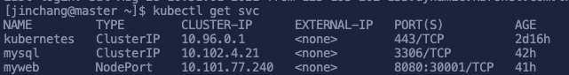
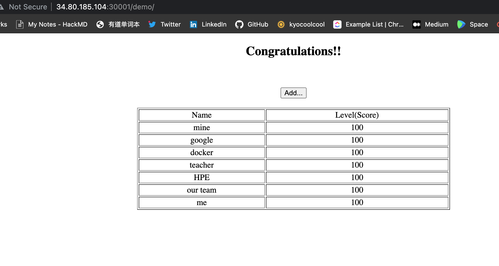

# A Simple Application

## Start MySQL Service

⛏ Create mysql-rc.yaml

```bash
vi  mysql-rc.yaml
```


```bash
apiVersion: v1
kind: ReplicationController
metadata:
  name: mysql
spec:
  replicas: 1
  selector:
    app: mysql
  template:
    metadata:
      labels:
        app: mysql
    spec:
      containers:
      - name: mysql
        image: mysql
        ports:
        - containerPort: 3306
        env:
        - name: MYSQL_ROOT_PASSWORD
          value: "123456"      
```


```bash
kubectl create -f mysql-rc.yaml
```

⛏ Create mysql-svc.yaml


```bash
apiVersion: v1
kind: Service
metadata:
  name: mysql
spec:
  ports:
  - port:3306
  selector:
    app: mysql
```


```bash
kubectl create -f mysql-svc.yaml
```

## Start Tomcat Application

⛏ Create myweb-rc.yaml


```bash
apiVersion: v1
kind: ReplicationController
metadata:
  name: myweb
spec:
  replicas: 5
  selector:
    app: myweb
  template:
    metadata:
      labels:
        app: myweb
    spec:
      containers:
      - name: myweb:5.7.35
        image: kubeguide/tomcat-app:v1
        ports:
        - containerPort: 8080
        env:
        - name: MYSQL_SERVICE_HOST
          value: 'mysql'
        - name: MYSQL_SERVICE_PORT
          value: '3306'
```


```bash
kubectl create -f myweb-rc.yaml
```

⛏ Create **myweb-svc.yaml**


```bash
apiVersion: v1
kind: Service
metadata:
  name: myweb
spec:
  type: NodePort
  ports:
    - port: 8080
      nodePort: 30001
  selector:
    app: myweb
```


```bash
kubectl create -f myweb-svc.yaml
```

## Connect to the Application

​​ ⛏ Display expose port  of 8080 mapping to 30001



⛏ Use Browser connect to the application


🧙♂ Connect IP is master external IP





