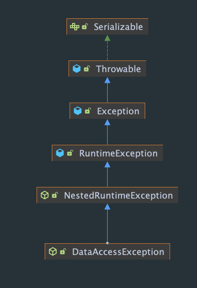

# Data Management: JDBC, Transactions, SpringData JPA

## ❓ Question1: What is the difference between checked and unchecked exceptions? Why does Spring prefer unchecked exceptions? What is the data access exception hierarchy?

Checked exception – Exception that is extending java.lang.Exception \(expect java.lang.RuntimeException\) class that has to be explicitly declared in throws part of method signature of the method that is throwing an exception and has to be explicitly handled by code that invokes the method. If code that is calling the method with checked exception does not handle the exception, it has to declare it in throws part of the method signature.

<table>
  <thead>
    <tr>
      <th style="text-align:left">Pros</th>
      <th style="text-align:left">Cons</th>
    </tr>
  </thead>
  <tbody>
    <tr>
      <td style="text-align:left">
        
A developer using API always has a list of

        
exceptional situations that has to be handled

      </td>
      <td style="text-align:left">May result in cluttered code</td>
    </tr>
    <tr>
      <td style="text-align:left">Fast compile-time feedback on check if all exceptional situations were
        handled</td>
      <td style="text-align:left">Coupling between callee and caller</td>
    </tr>
  </tbody>
</table>

Unchecked exception – Exception that is extending java.lang.RuntimeException class, does not have to be explicitly declared in throws part of method signature of method that is throwing an exception and does not have to be explicitly handled by code that invokes the method. The developer has freedom of choice if error handling should be implemented or not.

<table>
  <thead>
    <tr>
      <th style="text-align:left">Pros</th>
      <th style="text-align:left">Cons</th>
    </tr>
  </thead>
  <tbody>
    <tr>
      <td style="text-align:left">Reduces cluttered code</td>
      <td style="text-align:left">
        
May result in missing situations in which

        
error handling should be implemented

      </td>
    </tr>
    <tr>
      <td style="text-align:left">Reduces coupling between callee and caller</td>
      <td style="text-align:left">Lack of compile-time feedback on error handling</td>
    </tr>
  </tbody>
</table>

🎯 Data Access Exception is a Runtime Exception

🎯 Examples of concrete Data Access Exceptions

* CannotAcquireLockException
* CannotCreateRecordException
* DataIntegrityViolationException

🎯The purpose of this hierarchy is to create an abstraction layer on top of Data Access APIs to avoid coupling with the concrete implementation of Data Access APIs

## ❓ Question2: How do you configure a DataSource in Spring? Which bean is very useful for development/test databases?

Data Source is represented by generic interface javax.sql.DataSource that represents any data source for sql database.

To configure data source in Spring you need to create a @Configuration class that will return javax.sql.DataSource bean.

📋 You can use for example following types of javax.sql.DataSource

* DriverManagerDataSource – basic JDBC driver connection source
* BasicDataSource – Apache DBCP for Connection Pooling
* ComboPooledDataSource - C3P0 for Connection Pool
* SmartDataSource
* AbstractDataSource
* SingleConnectionDataSource
* TransactionAwareDataSourceProxy
* DataSourceTransactionManager

🎯 Configuration of Data Source in Spring is dependent on the type of application that is executed

📋 Type of execution

* Standalone – Data Source is configured in @Configuration class and is created as a bean of one of supported data source types
* Spring Boot – Data Source is configured through application.properties
* Application Server – Data Source should be fetched from JNDI via JndiDataSourceLookup / JndiTemplate, application server is responsible for creating and managing data source requested in resources configurations of deployment descriptors

📋 When working with development/test databases, following beans are very useful

* EmbeddedDatabaseBuilder – allows to easily configure H2/HSQLDB embedded database with schema/data initialization scripts
* DataSourceInitializer / ResourceDatabasePopulator – allows to use schema/data initialization scripts without usage of EmbeddedDatabaseBuilder

