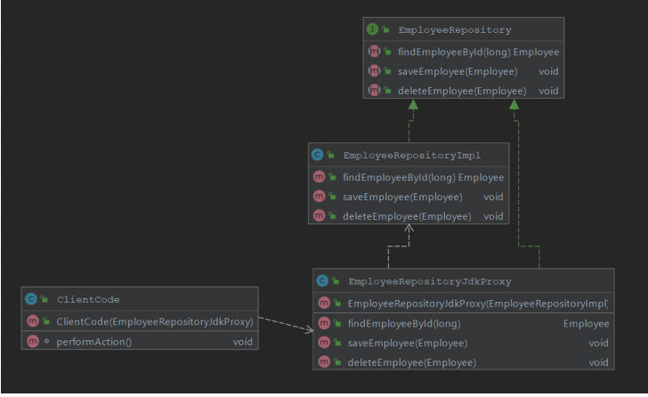
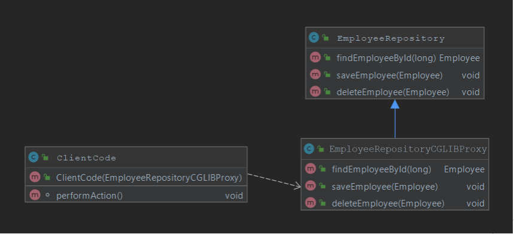

# Aspect-Oriented Programming

## ❓ Question1: What is the concept of AOP? Which problem does it solve? What is a cross-cutting concern? Name three typical cross-cutting concerns. What two problems arise if you don't solve a cross-cutting concern via AOP?

### ❓ What is the concept of AOP?

**AOP** – Aspect Oriented Programming – A programming paradigm that complements Object-oriented Programming \(OOP\) by providing a way to separate groups of cross-cutting concerns from business logic code. This is achieved by the ability to add additional behavior to the code without having to modify the code itself. This is achieved by specifying

* Location of the code which behavior should be altered – Pointcut is matched with Joinpoint
* Code which should be executed that implements cross-cutting concern – Advice

### ❓ Which problem does it solve?

📋 Aspect-Oriented Programming solves the following challenges

* Allows proper implementation of Cross-Cutting Concerns
* Solves Code Duplications by eliminating the need to repeat the code for functionalities across different layers, such functionalities may include logging, performance logging, monitoring, transactions, caching
* Avoids mixing unrelated code, for example mixing transaction logic code \(commit, rollback\) with business code makes code harder to read, by separating concerns code is easier to read, interpret, maintain

### ❓ Name three typical cross-cutting concerns?

📋 Common cross-cutting concerns

* Logging
* Performance Logging
* Caching
* Security
* Transactions
* Monitoring

### ❓ What two problems arise if you don't solve a cross-cutting concern via AOP?

📋 Implementing cross-cutting concerns without using AOP, produces the following challenges

* Code duplications – Before/After code duplicated in all locations when normally Advise would be applied, refactoring by extraction helps but does not fully solve the problem
* Mixing of concerns – business logic code mixed with logging, transactions, caching makes code hard read and maintain

## ❓ Question2: What is a pointcut, a join point, an advice, an aspect, weaving?

### Join Point in aspect oriented programming is a point in execution of a program in which behavior can be altered by AOP.


🧙♂ In Spring AOP Join Point is always method execution.


```java
public interface CurrencyService {
float getExchangeRate(String from, String to); //Join Point
float getExchangeRate(String from, String to, int multiplier); //Join Point
String getCurrencyLongName(CurrencyId currencyId); //Join Point
String getCurrencyCountryName(CurrencyId currencyId); //Join Point
}
```

📋 Aspect Oriented Programming concept in general, distinguishes additional Join Points, some of them include

* Method Execution / Invocation
* Constructor Execution / Invocation
* Reference / Assignment to Field
* Exception Handler
* Execution of Advice
* Execution of Static Initializer / Object Initializer

### Pointcut is a predicate used to match join point. Additional code, called Advice is executed in all parts of the program that are matching pointcut. Spring uses the AspectJ pointcut expression language by default.

📋 Example of Pointcut Expressions

* execution - Match Method Execution execution\(\* com.spring.professional.exam.tutorial.module02.question02.bls.CurrencyService.getExchangeRate\(..\)\)
* within - Match Execution of given type or types inside package within\(com.spring.professional.exam.tutorial.module02.question02.bls.\*\)
* @within – Match Execution of type annotated with annotation @within\(com.spring.professional.exam.tutorial.module02.question02.annotations.Secured\)
* @annotation – Match join points where the subject of the join point has the given annotation @annotation\(com.spring.professional.exam.tutorial.module02.question02.annotations.InTransaction\)
* bean – Match by spring bean name bean\(currency\_service\)
* args – Match by method arguments args\(String, String, int\)
* @args – Match by runtime type of the method arguments that have annotations of the given type @args\(com.spring.professional.exam.tutorial.module02.question02.annotations.Validated\)
* this – Match by bean reference being an instance of the given type \(for CGLIB-based proxy\) this\(com.spring.professional.exam.tutorial.module02.question02.bls.CurrencyService\)
* target – Match by target object being an instance of the given type target\(com.spring.professional.exam.tutorial.module02.question02.bls.CurrencyService\)
* @target – Match by class of the executing object having an annotation of the given type @target\(com.spring.professional.exam.tutorial.module02.question02.annotations.Secured\)

### Advice is additional behavior that will be inserted into the code, at each join point matched by pointcut.

```java
@Pointcut("@annotation(com.spring.professional.exam.tutorial.module02.question02.annotations.InTransaction)") //Pointcut
public void transactionAnnotationPointcut() { 
}
@Before("transactionAnnotationPointcut()") //Pointcut
public void beforeTransactionAnnotationAdvice() { 
System.out.println("Before - transactionAnnotationPointcut"); //Advice
}
@Before("this(com.spring.professional.exam.tutorial.module02.question02.bls.CurrenciesRepositoryImpl)") //Inline Pointcut
public void beforeThisCurrenciesRepository() {
System.out.println("Before - this(CurrenciesRepositoryImpl)"); //Advice
}
```

### Aspect brings together Pointcut and Advice. Usually it represents single behavior implemented by advice that will be added to all join points matched by pointcut.

```java
@Component
@Aspect
public class CurrenciesRepositoryAspect { //Aspect
@Before("this(com.spring.professional.exam.tutorial.module02.question02.bls.CurrenciesRepositoryImpl)") //Pointcut
public void beforeThisCurrenciesRepository() {
System.out.println("Before - this(CurrenciesRepositoryImpl)"); //Advice
}
}
```

### Weaving is the process of applying aspects, which modifies code behavior at join points that have matching pointcuts and associated advices. During weaving aspects and application code is combined which enables execution of cross-cutting concerns.

📋 Types of weaving

* Compile Time Weaving – byte code is modified during the compilation, aspects are applied, code is modified at join points matching pointcuts by applying advices
* Load Time Weaving – byte code is modified when classes are loaded by class loaders, during class loading aspects are applied, code is modified at join points matching pointcuts by applying advices
* Runtime Weaving – used by Spring AOP, for each object/bean subject to aspects, proxy object is created \(JDK Proxy or CGLIB Proxy\), proxy objects are used instead of original object, at each join point matching pointcut, method invocation is changed to apply code from advice

## ❓ Question3: How does Spring solve \(implement\) a cross cutting concern?

Spring Implements cross-cutting concerns with the usage of Spring AOP module. Spring AOP uses AspectJ expression syntax for Pointcut expressions, which are matched against Join Point, code is altered with logic implemented in advices. In Spring AOP Joint Point is always method invocation.

📋 Spring AOP uses Runtime Weaving, and for each type subject to aspects, to intercepts calls, spring creates one type of proxy

* JDK Proxy – created for classes that implements interface
* CGLIB Proxy – created for class that are not implementing any interface


🧙♂ It is possible to force Spring to use CGLIB Proxy with usage of

@EnableAspectJAutoProxy\(proxyTargetClass = true\)






## ❓ Question4: Which are the limitations of the two proxy-types? What visibility must Spring bean methods have to be proxied using Spring AOP?

### 📋 JDK Dynamic Proxy Limitations

* Does not support self-invocation
* Class must implement interface
* Only method implementing the interface will be proxied

### 📋 CGLIB Proxy Limitations

* Does not support self-invocation
* Class for which proxy should be created cannot not be final
* Method which should be proxied cannot be final
* Only public/protected/package methods will be proxied, private methods are not proxied

### 📋 Spring Bean Method needs to have following visibility level to be proxied

* JDK Dynamic Proxy – public
* CGLIB Proxy – public/protected/package


🧙♂ On top of requirement above, for call to be proxied, it needs to come from outside, both JDK Dynamic Proxy and CGLIB proxy does not support self-invocation.



